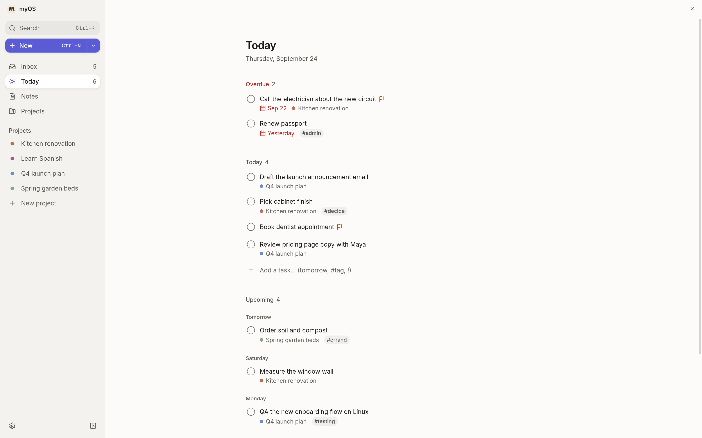

# myOS

myOS is a local-first Markdown editor and project workspace for macOS and Linux (including Omarchy). It turns an ordinary folder of `.md` files into a focused place for daily planning, project context, notes, and lightweight task management.

No account is required. myOS has no hosted sync service, telemetry, advertising, or bundled model provider. Your files stay in the folder you choose and remain usable in any text editor.



## What it does

- **Capture** anything with ⌘N. Type and press Enter; `tomorrow`, `every tue`, `~30m`, `#tag`, `@project`, and `!` are optional, and `@` and `#` autocomplete.
- **Inbox** holds captures until you sort them, one at a time, into tasks, notes, or projects.
- **Today** shows what was carried over, what is due or planned today, your projects' next steps, and a quiet look at the week ahead, with an honest "About 3 h planned · 6 h available" line.
- **Plan my day** and **Close the day** are short, optional rituals; a **Weekly review** appears on the day you choose, and **What moved** looks back at the week without scores or streaks.
- **Tasks** lists everything without a date, later tasks, and Someday, by project or area. Tasks can repeat, carry an estimate and a "when" cue, and `- [ ]` lines in any note count as tasks too.
- **Notes** is a search-first home for everything you write, with a calm editor, `/` blocks, `[[links]]` with backlinks and unlinked mentions, tag pages, templates, spaced review, and a focus mode.
- **Journal** keeps one page per day.
- **Projects** gather a short description, a next step, tasks, checklist items from their notes, and notes in one place.
- Every page edits its properties inline and autosaves. Areas (Work, Personal, Learning, Creative) keep files in tidy folders, and file names follow titles.
- Your files stay yours: saves change only what you changed, **Version history** keeps earlier copies outside your folder, and pages export as PDF or HTML. Edits made in another editor or by Git are picked up live, and myOS asks instead of overwriting.
- Light and dark themes, a choice of accent colors, and an optional serif reading font.

## Install

Download the latest release from [GitHub Releases](https://github.com/agent33894/myOS/releases). On macOS, use the `.dmg` or `.zip` and drag **myOS** to Applications. On Linux x64, download the `.AppImage`, make it executable, launch it, and run it once with `--install-desktop-entry` to add it to your launcher. A `.tar.gz` archive is also available. For a local Linux source build, `npm run install:local` builds and installs myOS in your home directory without sudo or FUSE. See [building and updating](docs/building-and-updating.md) for Omarchy integration, the `myos` terminal commands, and a Quick Capture keybinding.

The first launch asks you to choose a Markdown folder. Selecting a folder never uploads or relocates it. If you are starting fresh, myOS can create a small example workspace for you.

## Markdown compatibility

Plain Markdown files work without frontmatter. myOS derives a title from the first heading or filename and uses the containing folders as context.

Optional frontmatter enables richer project and task behavior:

```markdown
---
title: Ship the onboarding refresh
type: todo
status: active
project: my-project
priority: high
due: 2026-09-01
tags: [onboarding, release]
---

Keep the task body in ordinary Markdown.
```

The canonical artifact rules live in [`dashboard/shared/spec/`](dashboard/shared/spec/).

## Development

Requirements: macOS or Linux x64, Node.js 22+, and npm.

```bash
cd dashboard
npm install
npm run electron:dev
```

Validate a change:

```bash
npm run typecheck
npm run lint
npm test
npm run audit:ipc
npm run audit:dead-code
```

Build an Apple Silicon installer:

```bash
npm run build:installer
```

On Linux x64, build and install locally without sudo, or build distribution artifacts:

```bash
npm run install:local
npm run build:linux
npm run build:arch
```

Artifacts are written to `dashboard/release/`. See [`docs/building-and-updating.md`](docs/building-and-updating.md) for architecture builds and local installation.

## Project structure

```text
myOS/
├── dashboard/   Electron, React, local filesystem bridge, and tests
├── docs/        Architecture, artifact, design, and build documentation
└── vault/       Empty example folder structure; personal content is ignored
```

## Privacy and integrations

myOS reads and writes only the workspace folder you select, plus small local preferences in the operating system's application data directory. Network access is not required for core operation. Cloud synchronization and AI/model integrations are deliberately outside this repository; add your own local or organizational integration in a private fork if needed.

## License

[MIT](LICENSE)
