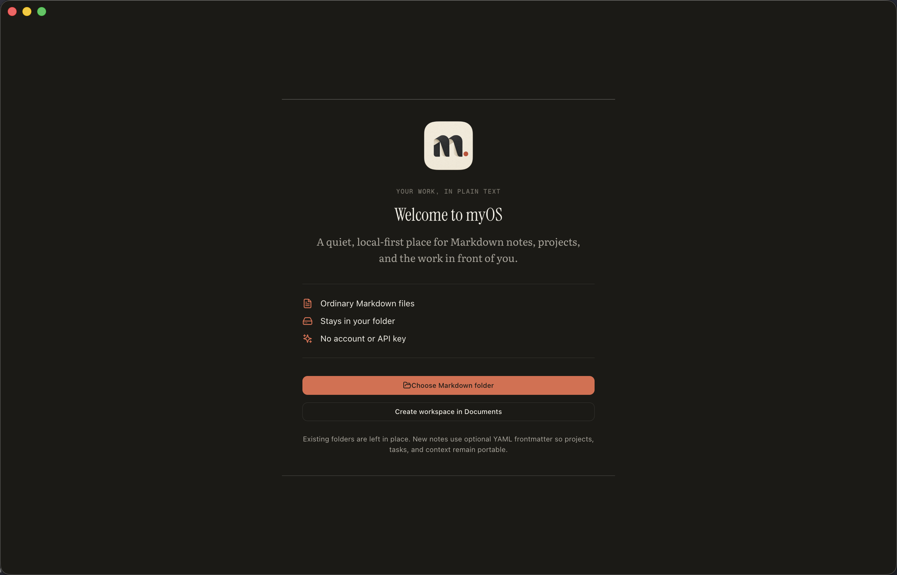

# myOS

myOS is a local-first Markdown editor and project workspace for macOS and Linux (including Omarchy). It turns an ordinary folder of `.md` files into a focused place for daily planning, project context, notes, and lightweight task management.

No account is required. myOS has no hosted sync service, telemetry, advertising, or bundled model provider. Your files stay in the folder you choose and remain usable in any text editor.



## What it does

- Opens an existing Markdown folder or creates a starter workspace in `Documents/myOS`
- Provides Today, Unfiled, Library, and Projects views
- Edits Markdown with source, reading, and split views
- Searches titles, tags, and full text across the workspace
- Tracks tasks and project context through optional YAML frontmatter
- Keeps new capture choices focused on Unfiled, Task, Note, and Project while still reading older typed files
- Renders code, tables, Mermaid diagrams, charts, callouts, KPIs, and roadmaps
- Watches the selected folder for changes made by Git or other editors
- Shows local Git activity and commit diffs when the folder is a repository
- Uses the Chronicle Mac v3 paper-and-ink interface in light and dark themes

## Install

Download the latest release from [GitHub Releases](https://github.com/agent33894/myOS/releases). On macOS, use the `.dmg` or `.zip` and drag **myOS** to Applications. On Linux x64, download the `.AppImage`, make it executable, launch it, and run it once with `--install-desktop-entry` to add it to your launcher. A `.tar.gz` archive is also available. For a local Linux source build, `npm run install:local` builds and installs myOS in your home directory without sudo or FUSE. See [building and updating](docs/building-and-updating.md) for Omarchy integration, the `myos` terminal commands, and a Quick Capture keybinding.

The first launch asks you to choose a Markdown folder. Selecting a folder never uploads or relocates it. If you are starting fresh, myOS can create a small example workspace for you.

## Markdown compatibility

Plain Markdown files work without frontmatter. myOS derives a title from the first heading or filename and uses the containing folders as context.

Optional frontmatter enables richer project and task behavior:

```markdown
---
title: Ship the onboarding refresh
type: todo
status: active
project: my-project
priority: high
due: 2026-09-01
tags: [onboarding, release]
---

Keep the task body in ordinary Markdown.
```

The canonical artifact rules live in [`dashboard/shared/spec/`](dashboard/shared/spec/).

## Development

Requirements: macOS or Linux x64, Node.js 22+, and npm.

```bash
cd dashboard
npm install
npm run electron:dev
```

Validate a change:

```bash
npm run typecheck
npm run lint
npm test
npm run audit:imports
npm run audit:ipc
npm run audit:dead-code
```

Build an Apple Silicon installer:

```bash
npm run build:installer
```

On Linux x64, build and install locally without sudo, or build distribution artifacts:

```bash
npm run install:local
npm run build:linux
npm run build:arch
```

Artifacts are written to `dashboard/release/`. See [`docs/building-and-updating.md`](docs/building-and-updating.md) for architecture builds and local installation.

## Project structure

```text
myOS/
├── dashboard/   Electron, React, local filesystem bridge, and tests
├── docs/        Architecture, artifact, design, and build documentation
└── vault/       Empty example folder structure; personal content is ignored
```

## Privacy and integrations

myOS reads and writes only the workspace folder you select, plus small local preferences in the operating system's application data directory. Network access is not required for core operation. Cloud synchronization and AI/model integrations are deliberately outside this repository; add your own local or organizational integration in a private fork if needed.

## License

[MIT](LICENSE)
